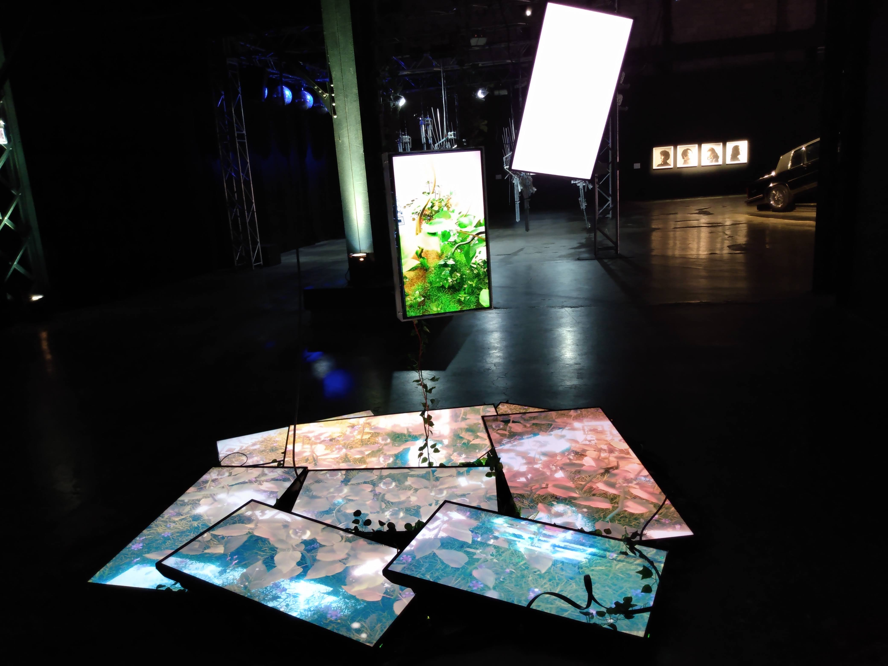
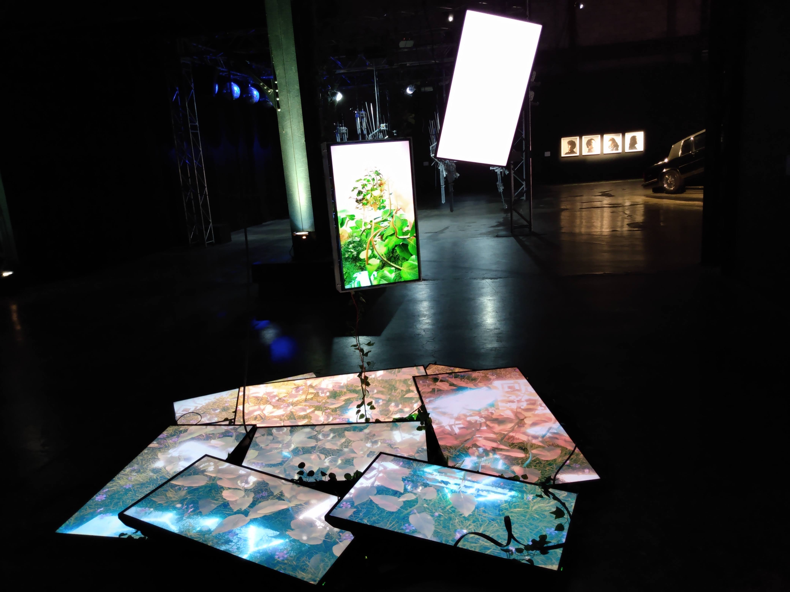

# Titre de l'oeuvre ou de la réalisation
## Nature morte 7

# Nom de l'artiste ou de la firme
## Baron Lanteigne

# Année de la réalisation
## 2022

# Nom de l'exposition ou de l'événement
## Biennale d'art numérique

# Lieu de mise en exposition
## Arsenal art contemporain

# Date de votre visite
## 3 février 2023

# Description de l'oeuvre ou du dispositif 

## Ce texte est tiré du cartel d'exposition de la Biennale d'art numérique, 2023.

# Explication de la mise en espace de l'oeuvre ou du dispositif 
## L'oeuvre met en place plusieurs écrans qui affiches des médias comprenenant des vidéo et des images numériques dans le but de créer un monde unique et homogène. Plusieurs câbles ou composants élétroniques situés à l'arrière des écrans. Des lianes sont placé un peu partout aux alentours des écrans pour donner plus un effet immersif qui rappelle à la réalité physique. Bref, c'est une oeuvre qui mélange une nature virtuelle et physique dans un but immersif.

# Liste des composantes et techniques de l'oeuvre ou du dipositif 
## Des écrans, des lianes, des composants élétroniques comme des fils de branchement.
 

# Expérience vécue et mes idées
## En se rapprochant de l'oeuvre, je me suis senti tout de suite immersé dans cette nature unique qui fait la combinaison d'éléments éléctroniques, virtuelles et physiques. Les écrans montrent des vidéos de plantes à la nature. Comme cité dans le cartel d'exposition, cette oeuvre nous rappelle l'omiprésence de la technologie dans nos vies et elle touche tous les domaines comme la nature. Un élément où l'on pense que l'environnement est souvent absente de technologie mais la technologie est tellement présente dans notre vie que l'on ne peut plus vraiment y échapper. Baron Lanteigne te fait plonger dans son univers unique et immersif qui a pour but de te faire ressentir la présence ubiquitaire de la technologie dans notre vie même dans des environnements naturels comme une forêt, même la nature peut se retrouver artificiel. Bref, c'est oeuvre immersive qui te plonge dans une grande réflexion sur la réalité de la technologie.

# Mon appréciation 
## J'ai vraiment apprécié la façon dont l'oeuvre était installée. Les écrans sont agencés part terre pour donner l'effet immersif que l'oeuvre a pour but. Pour faire plus simple, l'oeuvre se fait toute petite et n'est pas aussi grande et spectaculaire que certaines autres dans la salle mais c'est pas ça qui attire l'attention mais plutôt la disposition unique des écrans sur le plancher qui suscite l'intérêt. 

# Aspects à modifier
## Selon moi, j'aurais ajouté des effets sonores pour rajouter plus d'effet d'immersion que l'oeuvre tente de projeter. J'aurais utilisé comme par exemple des effets sonores de criquets et d'autres divers bruits insectes et animales pour renforcer l'effet de nature que les images à l'écrans projettent. 

