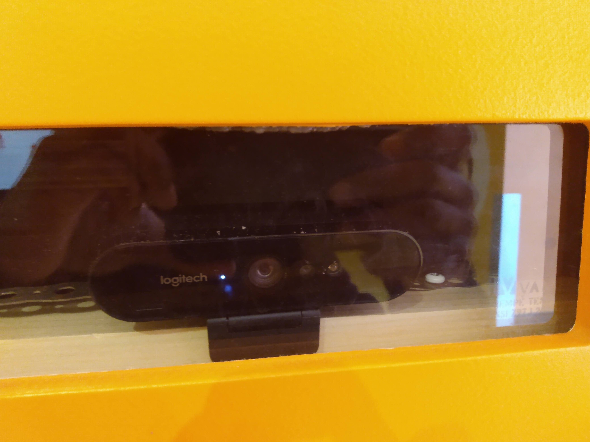

# Exposition humain au centre des sciences

## Nom de l'exposition ou de l'événement :
Humains

## Lieu de mise en exposition :
Salle des Sciences

## Date de la visite :
Mercredi 12 avril 2023

## Titre de l'oeuvre ou du dispositif :
Pas facile de saisir la balle au bond

## Année de réalisation :
2022/2023
## Nom de l'artiste ou de la firme :
Centre des Sciences

## Fonction du dispositif :
Ce dispositif a pour but d'éduquer les visiteurs sur l'évolution du temps de réactions chez l'humain

## Description de l'oeuvre :
Le visiteur est supposé se placer devant l'oeuvre sur une place précisée au sol et suivre les instructions sur l'écran. Il doit essayer de placer sa main pour attraper la balle virtuelle qui est affichée à l'écran et ainsi le visiteur peut remarquer que les réflexes diminuent aau fur à mesure que l'âge avance.

## Type d'installation :
Interactive
## Mise en espace :
Le dispositif se situe dans un couloir qui mène aux autres expositions. 

## Composantes techniques :
- Un écran 

- Une caméra capteurs de mouvements

- Des affichages

 ## Expérience vécue :
 J'ai vraiment vécue une bonne expérience avec cette oeuvre. J'ai vraiment appris beaucoup de cette oeuvre. On remarque très bien que les réflexes diminuent au fur et à mesure. L'oeuvre réagit bien avec tes mouvements et je sentais les animations sur l'écran très fluide et suivait bien mon mouvement. 
 
 ## Ce qui m'a plus :
 J'ai vraiment apprécié l'aspect éducatif de l'oeuvre.  
 
 ## Ce qui m'a pas plus :
C'est vraiment juste un petit détail mais j'aurais voulu que l'écran soit plus grand pour que je puisse apercevoir mieux les informations lettrées et visuelles présentées. Mais sinon c'est le seul élément que j'ai peu apprécié.

## Sources et références 
https://www.centredessciencesdemontreal.com/exposition-permanente/humain 
