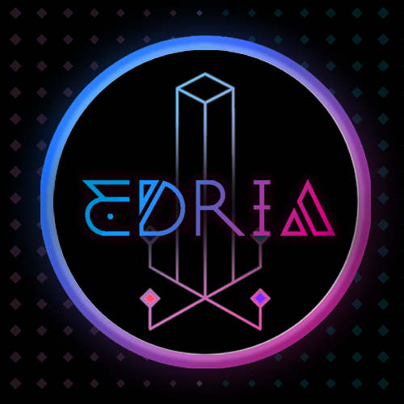

# Projet mycélium final

## Nom de l'exposition ou de l'événement :
Mycélium 

## Lieu de mise en exposition :
Collège Montmorency

## Date de la visite :
Vendredi 17 mars 2023

## Titre de l'oeuvre ou du dispositif :
Edria

## Noms des créateurs de l'oeuvre :
Elwin Durand Loic Delorme Dominic Roberts Gabriel Leblanc Meryem Berbiche Jean-Christophe Zephir

## Année de réalisation :
2022-2023
## Description de l'oeuvre :
Il se trouve cinq poteaux avec des décorations de plantes tout autour de la place. Un poteau central est placé au centre au se trouve des capteurs de présences pour permettre aux visiteurs d'intéragir avec l'oeuvre et enfin de pleinement profiter d'une expérience maximale. Lorsque quatre personnes se plaçent en même temps à chaque coins du capteurs, toutes les lumières s'allument en même temps et un son en particulier va jouer. 

## Type d'installation :
Interactive

## Mise en espace :
L'oeuvre est installé au mileu du parc de Montmorency au se trouve des bancs où des gens peuvent s'asseoir.

## Composantes techniques :
- Des fils et câbles
- Des poteaux de métals
- Des lumières DEL
- Des projecteurs de lumières
- Des haut-parleurs 
- Des caméras de surveillance
- Des décorations
- Des capteurs de mouvements 
- Un ordinateur
- Des logiciel (Madmapping)

## Éléments pour la mise en place :
- Des bancs
 
 ## Expérience vécue :
 C'était encore plus grandiose en vrai. Je suis allé la nuit et j'ai vraiment apprécié le décor comment il s'illumait la nuit. C'est vraiment  une oeuvre qui attire l'attention. Le projet marchait complèment donc je voyais toute l'ampleur du projet. C'était encore plus immersive qu'avant. Je me sentais vraiment parti d'un autre monde lumineux. Bref, j'ai vraiment vécu une expérience magistrale en vivant cette oeuvre.
 ## Ce qui m'a plus :
 Le jeu de lumière est vraiment un élément que j'ai vraiment bien apprécié. Je rtrouve que sans les lumières, leprojet ne fonctionnerait pas. Les lumières et la réactivité avec la détection de présence sont les éléments vitaux de cette présentation artistique. Ça m'a vraiment inspiré pour mes projets futures. 
 ## Ce qui m'a pas plus :
 J'aurais souhaité que les effets sonores soient plus forts pour rendre l'expérience encore plus immersive. 
 ## Ordre de préférences des projets (après) :
1- Edria
2- Echomarine
3- Nexum
4- Luma Sol
5-Zodie-Gal
 
 ## Sources et références :
https://tim-montmorency.com/2023/

