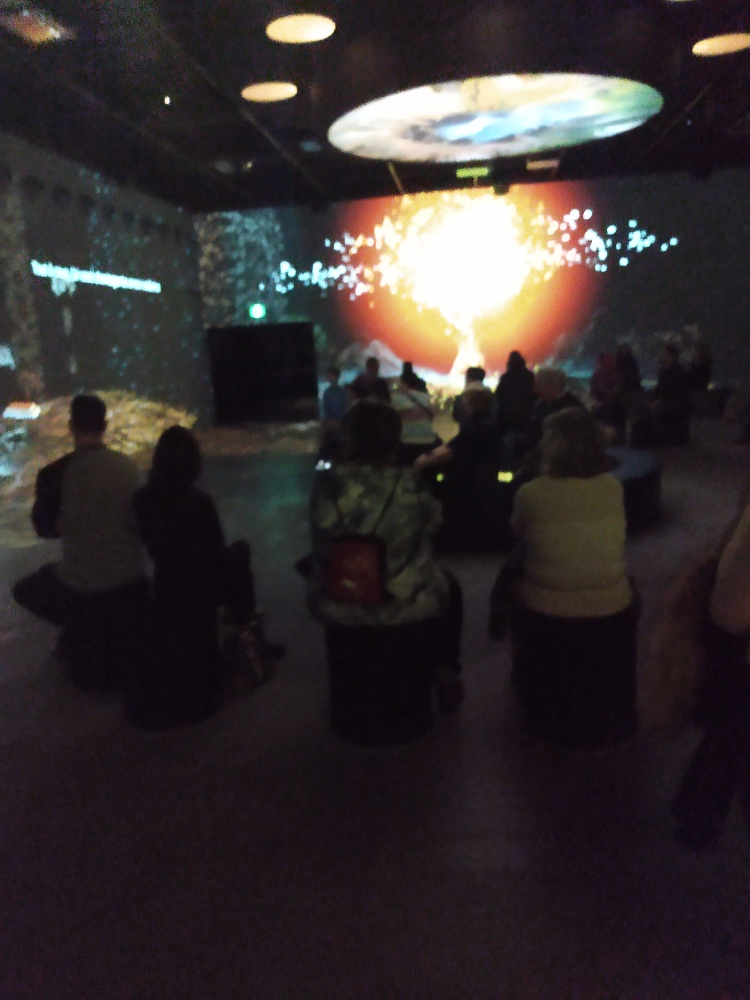

# Exposé oral 

## Nom de l'exposition ou de l'événement :
Transformé 

## Lieu de mise en exposition :
Oasis immersion

## Date de la visite :
Samedi 4 mars 2023

## Titre de l'oeuvre ou du dispositif :
Galerie Portail

## Noms des créateurs de l'oeuvre :
- On the morning you wake : Mike Brett, Steve Jamison, Arnaud Colinard et Pierre Zandrowicz 

## Objectif :
- L'objectif est de provoquer une réflexion sur notre compréhension de la menace nucléaire, tout en démontrant l'effet que cette expérience a eu sur toute une communauté.

Photo prise du site web
- Vestige : Aaron Bradbury

Photo prise du site web

## Année de réalisation :
2022/2023

## Description de l'oeuvre :
On the morning you wake : Cet oeuvre est une sorte de documentaire immersif qui parle d'une attaque d'un missile nucléaire qui attaquerait Hawai dans 38 minutes et comment les citoyens agiraient à l'annonce de cette nouvelle. Leur réaction de peur et d'angoisse sont relatées dans ce documentaire. Les créateurs utilisent des faits réels et expériences personnelles pour immerser le visiteur dans cet oeuvre. On présente des personnages en 3D pour nous permettre de visualiser les explications de l'oeuvre.

## Type d'installation : 
Contemplative

## Mise en espace :
Des bancs sont placés au milieu d'une salle ainsi qu'une structure placée pour que les visiteurs puissent s'assoir. Des vidéos sont projetées partout sur les murs aux quatre coins. 

## Composantes techniques :
- Des caméras de surveillance 
- Des projecteurs de lumières

- Des haut-parleurs 

 
 ## Expérience vécue :
 En assistant à cet oeuvre je ne m'attendais pas à être autant bouleversé. Ce documentaire présente en détails ce qui arriverait en cas d'une exposition nucléaire sur le corps humain. Les propos des citoyens attendant leur mort certaine sont vraiment poignants. Ça nous retourne l'estomac et nous fait réfléchir sur la chance qu'on a de ne pas se retrouver dans des situations extrêmes de ce genre. On se sent que la recherche a été minutieux et on ressent également la passion des créateurs de cet oeuvre dans ce projet. 
 
 
 
 ## Ce qui m'a plus :
 En regardant cette oeuvre, j'ai vraiment apprécié l'aspect éducatif de l'oeuvre comment on explique en détail la façon dont les effets radioactifs peuvent tuer.
 ## Ce qui m'a pas plus :
Ce que j'ai moins apprécié c'est que des fois il fallait que je me retourne car une partie de la présentation se passait sur le mur arrière de moi et ça m'irritait un peu lors ce que j'étais assis et j'ai du replacer ma chaise.
## Lien avec les autres oeuvres :
Je trouve vraiment qu'il y a un lien avec l'oeuvre à la BIAN : Lu Yang: Delusional World de Lu Yang et Louise Lecavalier.

## Ce que j'ai aimé le plus de toutes les oeuvres que j'ai apprécié :
J'ai vraiment apprécié les aspects informatives et éducatifs de ces oeuvres car j'ai vraiment appris beaucoup de choses au courant de ce cours. 
## Source et références :
https://oasis.im/en/transforme/
